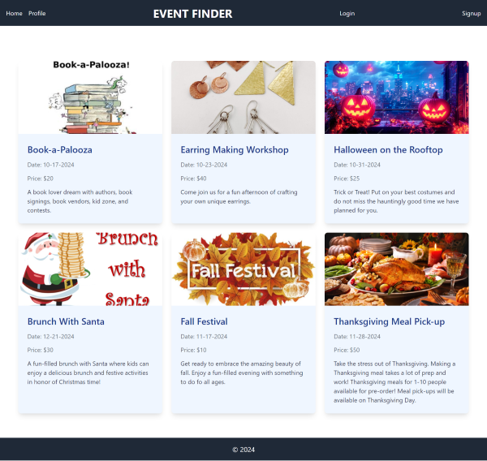
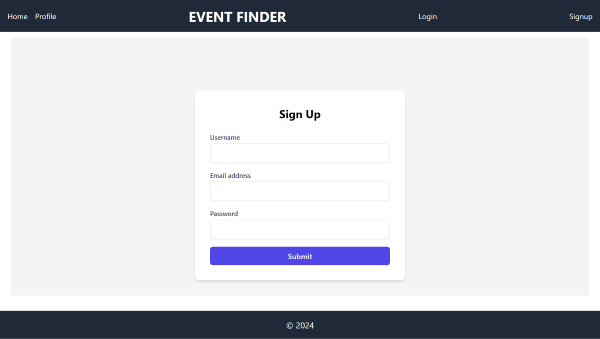
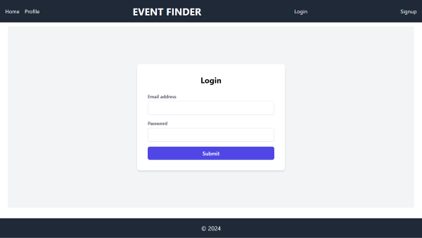
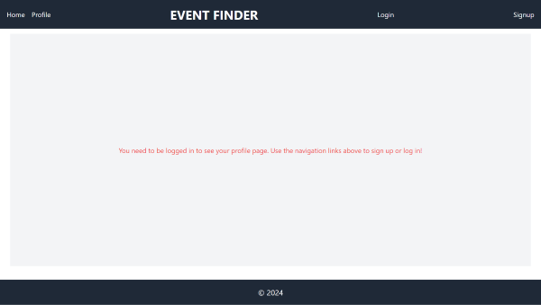
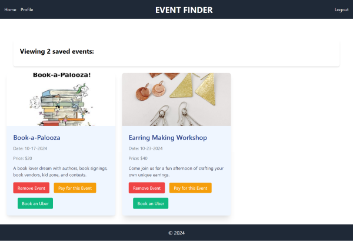
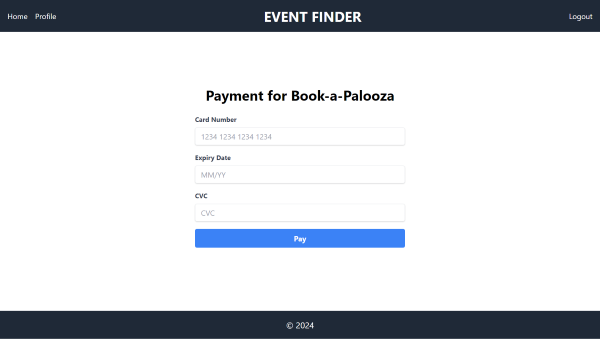

# MERN Event Finder

## Table of Contents
- [Introduction](#introduction)
- [User Story](#user-story)
- [Features](#features)
- [Installation](#installation)
- [Usage](#usage)
- [Technologies Used](#technologies-used)
- [Screenshots](#screenshots)
- [Links](#links)

## Introduction
MERN Event Finder is a web application built using the MERN stack (MongoDB, Express.js, React, Node.js) that allows users to find and save events. The application provides a user-friendly interface to browse through various events, view event details, and save events for future reference.

## User Story
Our event finder is a platform where users can discover and create social gatherings or events based on date and location.

## Features
- User authentication and authorization
- Browse and search for events
- View detailed information about events
- Save events to a personal list
- Responsive design for mobile and desktop

## Installation

```
npm install
```

```
npm run seed
```

```
npm run build
```

## Usage

```
npm start
```

## Technologies Used
- **Frontend**: React, Tailwind CSS
- **Backend**: Node.js, Express.js
- **Database**: MongoDB, Mongoose
- **Authentication**: JSON Web Tokens (JWT)
- **GraphQL**: Apollo Client, Apollo Server

## Screenshots















## Links

[Live URL](https://mern-event-finder.onrender.com/)

[GitHub Repo](https://github.com/zoniaramirez/MERN-event-finder)